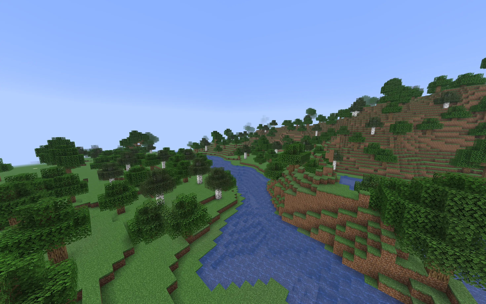
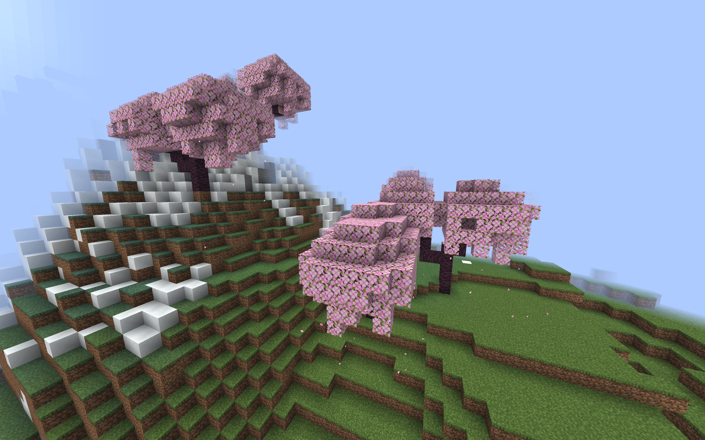
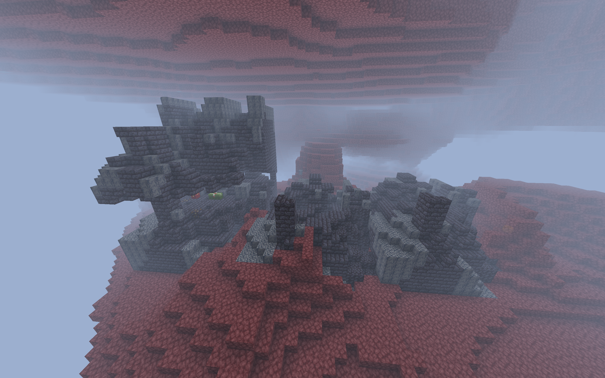
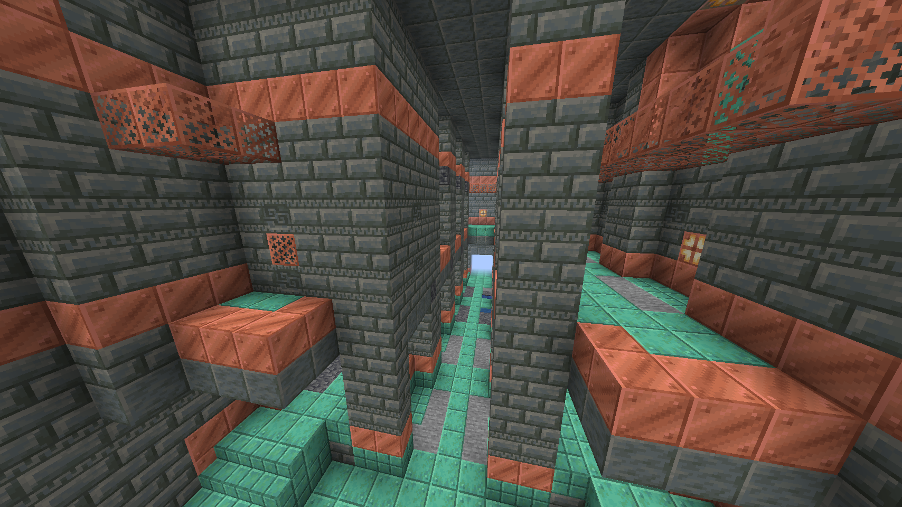

# worldgen
World generation for Minestom

## Installation

<details>
<summary>Gradle (Kotlin)</summary>
<br>

```kts [Gradle (Kotlin)]
repositories {
    maven("https://maven.skylite.gg/releases")
}

dependencies {
    implementation("rocks.minestom:worldgen:2026.08.28-26.2")
}
```

</details>

<details>
<summary>Gradle (Groovy)</summary>
<br>

```groovy [Gradle (Groovy)]
repositories {
    maven {
        url 'https://maven.skylite.gg/releases'
    }
}

dependencies {
    implementation 'rocks.minestom:worldgen:2026.08.28-26.2'
}
```

</details>

<details>
<summary>Maven</summary>
<br>

```xml [Maven]
<repositories>
    <repository>
        <id>skylite</id>
        <url>https://maven.skylite.gg/releases</url>
    </repository>
</repositories>

<dependencies>
    <dependency>
        <groupId>rocks.minestom</groupId>
        <artifactId>worldgen</artifactId>
        <version>2026.08.28-26.2</version>
    </dependency>
</dependencies>
```

</details>






