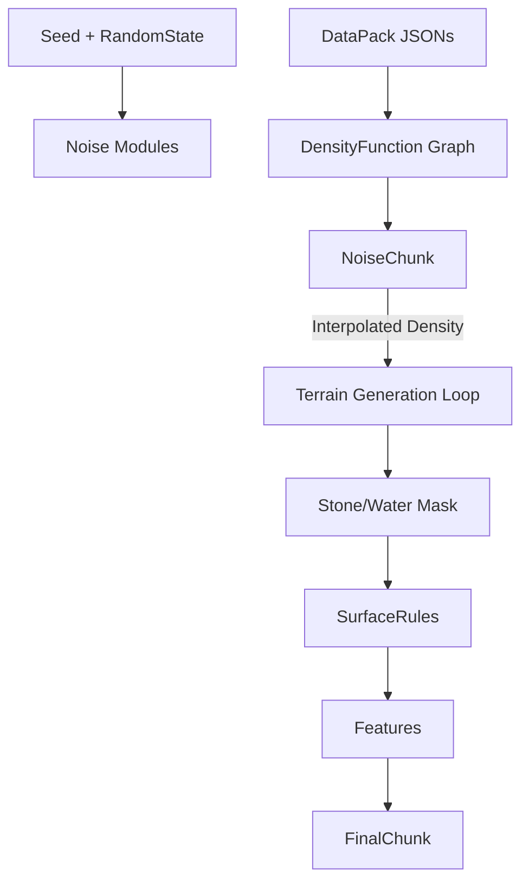

# World Generation Architecture

## Overview
The `worldgen` module implements a Minecraft-compatible terrain generation system. It mimics the behavior of modern Minecraft's "Noise Chunk" generator but is adapted for the Minestom server environment.

## Core Components

### 1. Entry Point: `WorldGenerators`
*   **Role**: Factory and Repository.
*   **Responsibility**:
    *   Initializes the `DataPack` (reads JSON configuration).
    *   Create `RandomState` (seeds and RNGs).
    *   Builds `WorldGenerator` instances for Overworld, Nether, and End.

### 2. The Coordinator: `WorldGenerator`
*   **Role**: The main pipeline runner.
*   **Responsibility**: Orchestrates the generation of a single chunk (`GenerationUnit`).
*   **Pipeline Stages**:
    1.  **Noise Interpolation**: Calculates density values for the base terrain (Stone/Air/Water).
    2.  **Surface Rules**: Replaces top layers of stone with biome-specific blocks (Grass, Sand, etc.).
    3.  **Structures**: Places large structures (Villages, Strongholds).
    4.  **decoration**: Places features (Ores, Trees, Flowers).

### 3. The Engine: `NoiseChunk`
*   **Role**: Optimization Engine.
*   **Context**: Calculating per-block noise is too slow.
*   **Mechanism**:
    *   Divides the chunk into "Cells" (usually 4x4x8 blocks).
    *   Calculates density *only* at cell corners.
    *   **Interpolates** values for blocks within the cell.
    *   Maintains a "Sliding Window" cache (Slice 0 and Slice 1) to reuse calculations as it iterates across the chunk.

### 4. Configuration: `DensityFunction` & `NoiseRouter`
*   **Role**: The "Brain" of the terrain shape.
*   **Description**: A functional graph (like a shader node graph) that inputs coordinates (x,y,z) and outputs a density value.
*   **Key Functions**:
    *   `finalDensity`: Determines if a block is solid (>0) or air (<0).
    *   `surface_height`: Used to determine where the ground is for feature placement.

## Data Flow

## Known Complexity & Tips for Maintainers

### The "Noise Loop" (`WorldGenerator.java`)
The nested loop in `generate()` is complex because it combines iteration with optimization.
*   **Outer Loops**: Iterate through *Cells* (optimization units).
*   **Inner Loops**: Iterate through *Blocks* within that cell.
*   **Slice Swapping**: As the loop moves in X, the `NoiseChunk` must "slide" its cache. This is manually triggered by `noiseChunk.swapSlices()`. **Do not remove this call.**

### Magic Numbers
*   **Quarts**: A "Quart" is a 4-block unit used for specific biome calculations.
    *   `x >> 2` means `x / 4`.
    *   `x << 2` means `x * 4`.

### Adding New Content
*   **New Noise Function**: Register in `DensityFunctionResolver`.
*   **New Feature**: Implement `Feature` interface and register in `FeatureLoader`.
